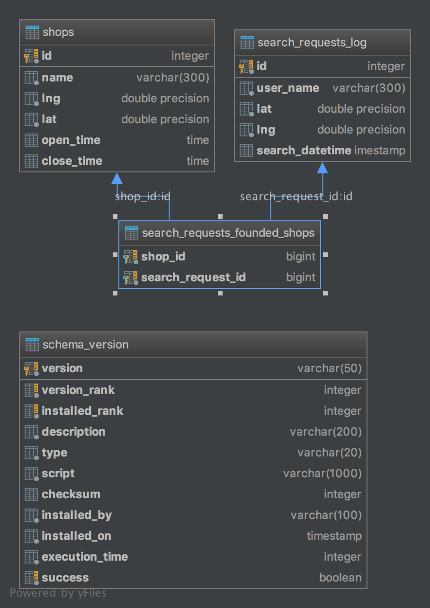

### Зависимости

Зависимости проекта

 - Java 8
 - PostgreSQL 9.6+

### Запуск

#### Настройки соединения с базой данных

Для запуска проекта сначала надо настроить соединение с базой
данных, для этого перейдите в папку `src/main/resources`, там найдите файл `application-dev.yml.sample`, 
скопируйте его в ту же папку с именем `application-dev.yml`. Внутри файла содержатся настройки для подключения 
к базе данных.

```yaml
spring:
  datasource:
    url: jdbc:postgresql://localhost:5433/root
    username: root
    password: root
```

Укажите здесь свои настройки. После того как это будет сделано,
можно приступить к компиляции и запуску проекта.

#### Запуск через Spring Plugin

Для запуска через `spring plugin`, воспользуйтесь следующей командой:

`./mvnw spring-boot:run`

Для windows используйте файл `mvnw.cmd`, не забудьте дать ему назначить права исполняемого файла.

#### Создание исполняемого jar файла

Для создания исполняемого jar файла воспользуйтесь следующей
командой

`./mvnw package -am -T4`

В папке `target` появится исполняемый `jar` файл, запустите его с помощью следующей
команды

`java -jar -server target/coordinates-0.0.1-SNAPSHOT.jar`

Для Windows используйте `mvnw.cmd`

### Завершающий этап

После того как вы проделали все шаги выше, можете перейти по адресу http://localhost:8080/, откроется web ui.

### Дополнительно

Схема базы данных

